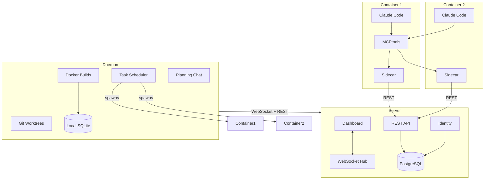
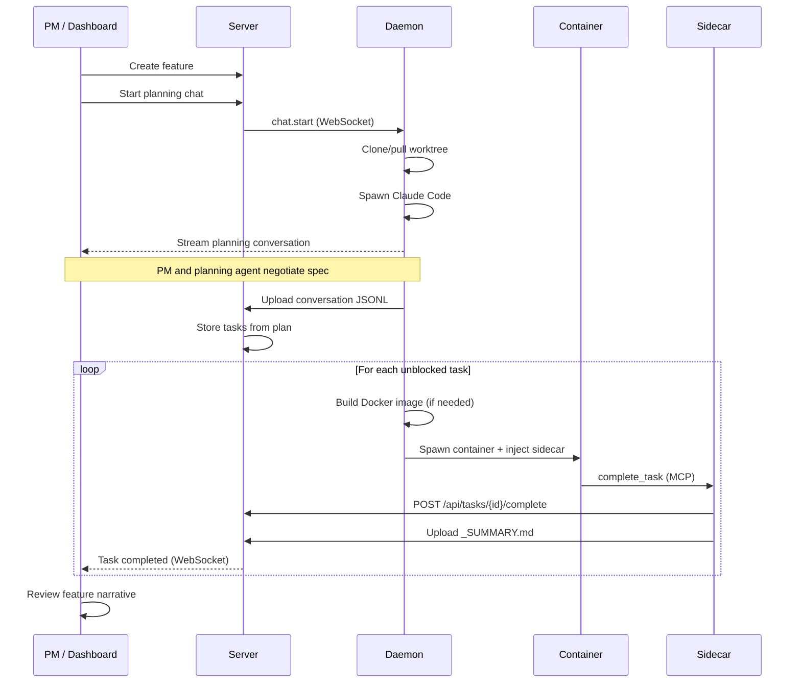
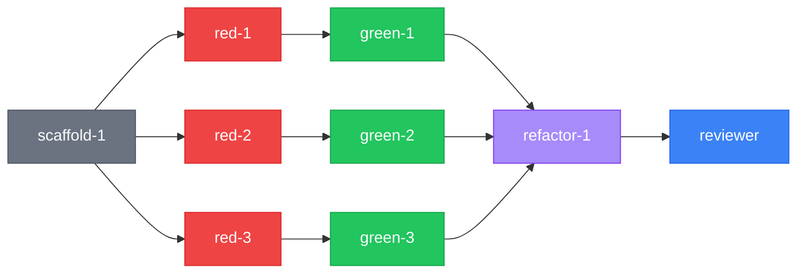

<p align="center">
  <picture>
    <source media="(prefers-color-scheme: dark)" srcset="images/logo-dark.svg">
    <source media="(prefers-color-scheme: light)" srcset="images/logo-light.svg">
    
  </picture>
</p>

<h3 align="center">Describe the feature. Agents build it.</h3>

<p align="center">
  Agach orchestrates AI coding agents for your team.<br/>
  Define features through structured conversations. Agents execute the work<br/>
  in isolated environments, one task at a time, on your codebase.<br/>
  <strong>Open source · Self-hosted · Your code stays on your infrastructure</strong>
</p>

<p align="center">
  <a href="#how-it-works">How It Works</a> ·
  <a href="#quick-start">Quick Start</a> ·
  <a href="#features">Features</a> ·
  <a href="#architecture">Architecture</a> ·
  <a href="#status">Status</a>
</p>

---

## The problem

AI can write code. The bottleneck moved.

Agent sessions start with zero context — prior decisions, what was tried and failed, all gone. Specs are a prompt someone types and hopes for the best. When a feature breaks weeks later, the fixing agent has no idea what the original intent was or which contracts must still hold. And the PM asks "what's the status?" while the answer lives in terminal windows nobody is watching.

What's missing is the layer that connects a feature description to autonomous agent execution — with structured planning, context preservation across tasks, quality gates, cost tracking, and visibility for the whole team.

## How it works

Agach has four components: a **server** (dashboard + API), a **daemon** (runs on your machine or build server), a **sidecar** (runs inside each agent container), and **agent definitions** (prompt templates that define how agents work).

### 1. Define the feature

A team member describes what they want. A planning agent reads the codebase, challenges vague requirements, negotiates scope, and produces structured task files with testable acceptance criteria — before any code is written.

The planning conversation happens through the dashboard. The daemon spawns a Claude Code session on a git worktree of your repo, and messages flow bidirectionally in real time. Token costs are tracked live. The full conversation is persisted and searchable — it becomes the "why" behind every feature.

```
You:    We need OAuth2 login with Google
Agent:  "Handle errors gracefully" — what does that mean concretely?
        Return 400? Log and continue? Show a user-facing message?
You:    Return 401 with a JSON error body for invalid tokens
Agent:  Got it. Creating 6 tasks with dependencies...
```

The planning agent produces: a feature spec with acceptance criteria, a dependency graph, and one file per task with context, pre-checks, and circuit breakers.

### 2. Agents execute the work

The daemon picks up unblocked tasks, prepares isolated Docker containers, and runs one agent session per task. Each container gets the sidecar injected automatically — the agent interacts with agach through MCP tools exposed by the sidecar, while the sidecar handles all communication with the server.

```
[14:02] picking up task-3 — refresh token rotation
        loading parent summaries: task-1, task-2
        spawning container with sidecar...

[14:18] task-3 completed — summary pushed via sidecar
        tokens: 42,180 in / 8,340 out

[14:18] task-4 unblocked — token revocation on logout
```

Inside the container, the agent sees MCP tools like `complete_task`, `create_subtask`, `report_blocked`, and `push_summary`. The sidecar translates these into server API calls, uploads summary files, and streams status updates back to the daemon. The agent never talks to the server directly — the sidecar is the only bridge.

Tasks follow a TDD workflow: a **red** agent writes a failing test, a **green** agent makes it pass with minimal implementation, a **refactor** agent cleans up, and a **reviewer** validates against the original acceptance criteria.

### 3. Review the narrative, not the code

When work completes, the dashboard shows the full feature narrative — every task summary, in execution order. You read the decisions agents made, not thousands of lines of generated code. The code diff is there when you need it, but the summaries are where you catch architectural mistakes, scope creep, and misinterpreted requirements.

The merge request goes through your existing review pipeline. Agach doesn't replace your tools. It feeds them.

### 4. Bugs flow backward

When a bug is reported against a completed feature, the original task files, acceptance criteria, planning conversation, and completion summaries are all available as context. The fixing agent knows what was built, why, and which contracts must still hold:

```
✓  Provider config loads from env
✓  Login redirects to Google
✗  Refresh token rotates on expiry       ← broken
✓  Logout revokes all tokens
✓  Integration tests pass
```

## Quick start

```bash
git clone https://github.com/JLugagne/agach.git
cd agach
docker compose up --build
```

Open `http://localhost:8322`. Default credentials: `admin@agach.local` / `admin` — change this immediately.

### Connect the daemon

On the dashboard, generate an onboarding code under Nodes. Then on your machine:

```bash
export AGACH_SERVER_URL=http://localhost:8322
export AGACH_ONBOARDING_CODE=123456
agach-daemon
```

The daemon registers with the server, receives tokens, and connects via WebSocket.

## Features

### Server

- **Feature lifecycle** — Draft → ready → in progress → done → blocked. Task summaries per feature. Feature-level statistics
- **Kanban board** — Four columns, drag-and-drop, inline editing, live WebSocket updates, task dependencies, WIP limits
- **Feature narrative** — All task summaries for a feature in execution order. The primary review surface
- **Agent management** — Define agents with prompt templates, skills, and tech stacks. Assign to projects. Clone and customize
- **Skills** — Reusable capabilities that attach to agents. Manage independently, compose freely
- **Dockerfiles** — Versioned container definitions attached to projects. The daemon builds images from these
- **Identity** — Users, teams, JWT auth, API keys, SSO (Google, GitHub), role-based access
- **Nodes** — Register daemon instances through time-limited onboarding codes. Track status, manage access
- **Notifications** — Project, agent, and global scope. Severity levels. Read tracking
- **Cost tracking** — Per-task token usage (input, output, cache), cold start metrics, per-model cost breakdowns
- **Statistics** — Task velocity, token usage, model costs, feature completion rates
- **REST API** — Full CRUD for every entity
- **Real-time** — WebSocket events for the dashboard and daemon communication

### Daemon

- **Planning chat** — Spawns Claude Code on a git worktree, streams messages bidirectionally through the dashboard, tracks costs live, persists the full conversation on session end
- **Git worktree management** — Clone-or-pull with SSH and HTTPS auth, per-project caching
- **Docker builds** — Build, inspect, prune images. Stream build logs. Local SQLite for build history
- **Container orchestration** — Spawns Docker containers per task, injects the sidecar binary automatically, mounts the worktree, collects results on exit
- **Secure onboarding** — 6-digit codes, 15-minute TTL, single use, automatic token refresh
- **Session lifecycle** — 30-minute idle TTL with warnings, graceful shutdown, JSONL upload on end

### Sidecar

The sidecar is a small binary injected into every agent container at startup by the daemon. It runs alongside Claude Code inside the container and provides the bridge between the agent and the agach server.

- **MCP server** — Exposes agach operations as MCP tools that the agent calls naturally: `complete_task`, `create_subtask`, `report_blocked`, `push_summary`, `attach_file`, `add_comment`
- **Summary upload** — Watches for `_SUMMARY.md` files and pushes them to the server automatically
- **Status streaming** — Reports task progress, token usage, and agent state back to the daemon via a local socket
- **Token forwarding** — Authenticates with the server using daemon-scoped credentials. The agent never sees or handles auth tokens
- **Heartbeat** — Sends periodic liveness signals so the daemon and dashboard know the container is still working
- **Graceful shutdown** — On container stop, flushes pending summaries and status updates before exiting

### Agent definitions (included)

- **planner** — Reads the codebase, challenges requirements, generates feature spec and all task files
- **grumpy-pm** — Same output as planner, but reaches it through adversarial dialogue. Stress-tests your assumptions
- **scaffolding** — Creates empty file skeletons so the build passes before any logic is written
- **red** — Writes one failing test per task. Compiles, fails for the right reason
- **green** — Makes the failing test pass with minimal implementation. Nothing more
- **refactor** — Cleans up after green. No behavior changes
- **reviewer** — Validates all acceptance criteria against the original feature spec
- **rebase** — Handles merge conflicts

### Testing

- 91 Go test files including 28 security tests documenting specific vulnerabilities with line references
- Contract test pattern: every repository interface has a mock and behavioral test suite
- Playwright E2E suite with deterministic seed data and Docker Compose infrastructure

## Architecture

Four components:

| Component | Purpose |
|-----------|---------|
| `agach-server` | Dashboard, REST API, WebSocket hub, identity, auth |
| `agach-daemon` | Planning chat, git worktrees, Docker builds, container orchestration |
| `agach-sidecar` | MCP server inside agent containers — bridges agent ↔ server |
| `agach` | Terminal UI for interactive monitoring (being merged into daemon) |

### System overview



### Task execution flow



### TDD agent workflow



### Project structure

```
internal/
  server/            # Project management
    domain/          #   Types, errors, repository interfaces
    app/             #   Business logic, prompt rendering
    inbound/         #   REST handlers, converters
    outbound/pg/     #   PostgreSQL + migrations
    ux/              #   React + TypeScript dashboard
  identity/          # Auth, users, teams, nodes
    domain/          #   Types, repositories, service interfaces
    app/             #   Auth, SSO, onboarding, node management
    inbound/         #   REST handlers
    outbound/pg/     #   PostgreSQL
  daemon/            # Agent orchestration
    domain/          #   Types, build repository
    app/             #   Chat manager, git service, Docker service
    client/          #   Onboarding, auth, projects, upload clients
    inbound/ws/      #   WebSocket event handlers
    outbound/sqlite/ #   Local build history
  sidecar/           # In-container bridge (planned)
    mcp/             #   MCP tool definitions
    client/          #   Server API client
    watcher/         #   Summary file watcher
pkg/
  server/            # Shared DTOs with validation
  daemonws/          # Shared WebSocket protocol (docker + chat events)
  controller/        # HTTP response helpers
  middleware/        # Auth, rate limiting, body limits
  websocket/         # WebSocket hub
  sse/               # Server-sent events hub
```

Hexagonal architecture. Domain owns the interfaces. Each bounded context has its own persistence and no imports from other contexts.

### Tech stack

| Layer | Technology |
|-------|------------|
| Server | Go, gorilla/mux, gorilla/websocket, pgx |
| Database | PostgreSQL 17 (server), SQLite (daemon local state) |
| Frontend | React, TypeScript, Tailwind CSS, Vite |
| Daemon | Go, go-git, Docker SDK, gorilla/websocket |
| Sidecar | Go, MCP SDK, file watcher |
| Auth | JWT (HS256), bcrypt, API keys, OAuth2 SSO |
| Agent runtime | Claude Code (`--output-format streaming-json`) |
| Testing | testify, Playwright, testcontainers-go |

## Status

Agach is in **alpha**.

### Working

| Component | Details |
|-----------|---------|
| Server — dashboard, REST API, WebSocket | Full CRUD, live updates, embedded SPA |
| Identity — auth, SSO, teams, API keys | JWT, bcrypt, OAuth2, node management |
| Feature management and lifecycle | Draft → ready → in progress → done → blocked |
| Agent and skill management | CRUD, project assignment, cloning |
| Dockerfile management | Versioned definitions, project assignment |
| Node onboarding and management | 6-digit codes, token refresh, access control |
| Daemon — onboarding and Docker builds | Build, inspect, prune, stream logs |
| Daemon — planning chat | Bidirectional streaming, live costs, JSONL persistence |
| Daemon — git worktree management | Clone-or-pull, SSH + HTTPS, per-project cache |
| Planning agents (planner, grumpy-pm) | Via Claude Code with included agent definitions |
| TDD agents (red, green, refactor, reviewer) | Via Claude Code with included agent definitions |

### In progress

| Component | Details |
|-----------|---------|
| Daemon — task execution loop | Picks unblocked tasks, spawns containers, monitors completion |
| Sidecar — MCP server | Exposes `complete_task`, `create_subtask`, `report_blocked`, `push_summary`, `attach_file`, `add_comment` as MCP tools inside the container |
| Sidecar — summary watcher | Detects `_SUMMARY.md` files and uploads them to the server automatically |
| Sidecar — status streaming | Reports token usage, agent state, and heartbeat to the daemon |
| Sidecar — auto-injection | Daemon copies the sidecar binary into the container at startup and configures Claude Code to use it as an MCP server |

### Planned

| Component | Details |
|-----------|---------|
| Feature narrative view | All task summaries for a feature in execution order — the primary review surface |
| Regression-aware bug context | Regenerate feature context with red/green acceptance criteria for bug fixes |
| Planning chat in dashboard | Integrated chat UI connected to the daemon's chat manager |
| Cost budgets | Per-feature token budget with alerts and auto-pause |

## Contributing

Contributions welcome. Open an issue or submit a pull request.

## License

MIT
