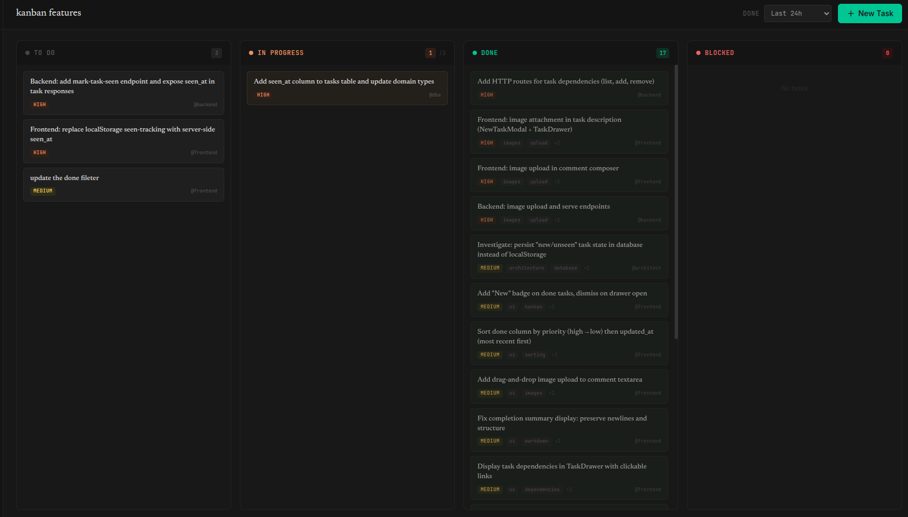

# Agach MCP

<p align="center">
  
</p>

<p align="center">
  <strong>A Kanban board that AI agents use as their shared brain.</strong><br/>
  <em>Give your Claude Code, Gemini CLI, and other MCP agents a place to coordinate — and keep yourself in the loop.</em>
</p>

<p align="center">
  <a href="#quick-start">Quick Start</a> &bull;
  <a href="#why-this-exists">Why</a> &bull;
  <a href="#how-it-works">How It Works</a> &bull;
  <a href="#features">Features</a> &bull;
  <a href="#mcp-tools-reference">MCP Tools</a>
</p>

---

## Why This Exists

If you've ever run two or more AI coding agents on the same project, you've felt the pain: agents duplicate work, step on each other's changes, lose context between sessions, and have no way to tell you they're stuck. You end up babysitting them in separate terminals, manually deciding who works on what.

**Agach MCP** fixes this by giving agents a structured way to self-organize. It's a Kanban board exposed as an [MCP server](https://modelcontextprotocol.io/) — agents connect to it, pick tasks, report progress, and flag blockers. You watch everything happen in real time through a web UI and step in only when needed.

It's useful even with a single agent: the board gives your AI a persistent memory of what's been done, what's left, and what decisions were made — across sessions.

<p align="center">
  
</p>

## How It Works

```
┌─────────────┐     MCP (port 8323)     ┌──────────────────┐
│ Claude Code  ├───────────────────────►│                  │
│   Agent #1   │                        │                  │
├─────────────┤                        │   Agach Server   │
│ Claude Code  ├───────────────────────►│                  │
│   Agent #2   │                        │  ┌────────────┐  │
├─────────────┤                        │  │  SQLite DB  │  │
│ Gemini CLI   ├───────────────────────►│  └────────────┘  │
│   Agent #3   │                        │                  │
└─────────────┘                        └───────┬──────────┘
                                               │
                                    HTTP + WebSocket (port 8322)
                                               │
                                       ┌───────▼──────────┐
                                       │   Web UI          │
                                       │   (You, human)    │
                                       └──────────────────┘
```

**Agents** connect via MCP and interact through tools: create tasks, pick the next thing to work on, mark tasks done, flag blockers, leave comments for each other.

**You** interact through a real-time web UI with drag-and-drop, inline editing, and moderation controls. WebSocket keeps everything live — no refreshing.

The server runs on two ports: **8322** for the web UI and REST API, **8323** for the MCP server that agents talk to.

## Quick Start

### 1. Run the Server

**Docker (recommended):**

```bash
git clone https://github.com/JLugagne/agach-mcp.git
cd agach-mcp
docker-compose up --build
```

**Or build locally** (requires Go 1.25+ and Node.js):

```bash
# Build frontend
cd ux && npm install && npm run build && cd ..

# Build and run
go build -o agach-mcp ./cmd/agach-server/
./agach-mcp
```

### 2. Connect Your Agents

**Claude Code:**

```bash
claude mcp add agach --transport http http://127.0.0.1:8323/mcp
```

**Gemini CLI** — add to `~/.gemini/settings.json`:

```json
{
  "mcpServers": {
    "agach": {
      "uri": "http://127.0.0.1:8323/mcp"
    }
  }
}
```

**Any MCP-compatible agent** — point it at `http://127.0.0.1:8323/mcp` (Streamable HTTP transport).

### 3. Create a Project and Go

```
You:   "Create a project called 'api-refactor' and break the work into
        tasks for the backend and frontend roles."

Agent: *creates project, creates tasks with priorities and dependencies*

You:   "Pick up the next backend task and start working."

Agent: *calls get_next_task, picks the highest-priority unblocked task,
        moves it to in_progress, starts coding*
```

Open `http://localhost:8322` to watch the board update in real time.

## Features

### For Agents

- **Smart task picking** — `get_next_task` returns the highest-priority task in "todo" with all dependencies resolved. Agents never pick work out of order or duplicate each other.
- **Dependency management** — Tasks can depend on other tasks. A task only becomes available when all its dependencies are in "done".
- **Completion context** — When an agent finishes a task, it writes a completion summary and lists files modified. Downstream tasks can reference this context.
- **Resolution tracking** — When work is interrupted, agents record what was done so the next agent (or session) can pick up where they left off.
- **Blocking** — Agents can move tasks to "blocked" with a reason when they're stuck. Only humans can unblock.
- **Won't-do requests** — Agents can request to skip a task with justification. Humans approve or reject.
- **Full-text search** — `list_tasks(search=...)` searches across title, summary, description, and tags.
- **Token tracking** — Agents report token usage (input, output, cache read/write) per task for cost visibility.
- **Sub-project scoping** — `get_next_task` can be scoped to a sub-project tree, so agents working on different areas don't interfere.
- **Lightweight board overview** — `get_board` returns task counts instead of full payloads, saving tokens.

### For Humans

- **Real-time Kanban board** — Four columns (To Do, In Progress, Done, Blocked) with WebSocket-powered live updates.
- **Drag-and-drop** — Move tasks between columns. When you move a task from "in_progress" back to "todo", the system auto-appends a note so the next agent knows it was interrupted.
- **Task detail drawer** — Full task view with description, dependencies, completion summary, comments, file tracking. Supports deep-linking (`?task={id}`).
- **"New" badges** — Done tasks show a badge until you open them, so you can spot what agents completed since your last check.
- **Comment system** — Both agents and humans can leave markdown comments with inline images on any task.
- **Done column filtering** — Filter completed tasks by time window (1h to 30d) and sort by priority or recency.
- **Inline editing** — Edit descriptions, priorities, roles, and prompt hints directly in the UI.
- **Role management** — Define agent roles (backend, frontend, architect, QA, etc.) with tech stacks and prompt hints.
- **Sub-projects** — Hierarchical project organization with drill-down views.
- **Statistics** — Charts for task velocity, token usage, and role productivity.
- **Image attachments** — Drag-and-drop images in descriptions and comments.
- **Markdown everywhere** — GFM rendering with syntax highlighting.

### Operational

- **Zero dependencies** — Single binary + SQLite. No Postgres, no Redis, no message broker.
- **Per-project databases** — Each project gets its own SQLite DB. Clean isolation, easy backup.
- **WIP limits** — In Progress column caps at 3 tasks to prevent agents from piling up unfinished work.
- **Four-level priority** — Critical, high, medium, low. No complex scoring algorithms — agents understand it immediately.
- **Role-based filtering** — Assign tasks to roles so agents only see work relevant to their specialization.
- **File tracking** — Tasks track both files modified and context files relevant to the work.
- **REST API** — Full CRUD alongside MCP, so you can script or integrate with other tools.

## The Board

| Column | Purpose |
|--------|---------|
| **To Do** | Backlog. Agents pick from here via `get_next_task`. |
| **In Progress** | Active work. WIP limit of 3. |
| **Done** | Completed tasks with summaries that feed downstream work. |
| **Blocked** | Needs human attention. Agents can't touch these — only you can. |

## MCP Tools Reference

| Category | Tools |
|----------|-------|
| **Projects** | `create_project`, `update_project`, `delete_project`, `list_projects`, `list_sub_projects`, `get_project_info` |
| **Roles** | `list_roles`, `get_role`, `update_role` |
| **Tasks** | `create_task`, `update_task`, `update_task_files`, `move_task`, `move_task_to_project`, `start_task`, `complete_task`, `block_task`, `request_wont_do`, `get_task`, `list_tasks`, `get_next_task` |
| **Dependencies** | `add_dependency`, `remove_dependency`, `list_dependencies` |
| **Comments** | `add_comment`, `list_comments` |
| **Board** | `get_board` |

### Key Behaviors

- **`get_next_task(role?, sub_project_id?)`** — Highest-priority "todo" task with all dependencies resolved. Filters by role. Optionally scoped to a sub-project tree.
- **`complete_task(completion_summary, files_modified)`** — Marks done with a structured summary for downstream agents.
- **`block_task(reason)`** — Moves to Blocked. Only humans can unblock via the web UI.
- **`request_wont_do(reason)`** — Moves to Blocked with a "Won't Do" request. Humans approve or reject.
- **`list_tasks(search?, ...filters)`** — Full-text search + filtering by column, role, priority, status.
- **`get_board(project_id)`** — Lightweight board overview (counts only, no full task payloads).
- **`move_task_to_project(task_id, target_project_id)`** — Moves a task between sibling sub-projects.

## Configuration

| Variable | Default | Description |
|----------|---------|-------------|
| `AGACH_HOST` | `127.0.0.1` | HTTP server bind address |
| `AGACH_PORT` | `8322` | HTTP server port |
| `AGACH_MCP_HOST` | `127.0.0.1` | MCP server bind address |
| `AGACH_MCP_PORT` | `8323` | MCP server port |
| `AGACH_DATA_DIR` | `./data` | SQLite databases directory |

## Architecture

```
cmd/agach-server/        # Entry point (two-port server)
internal/kanban/
  domain/                # Types, errors, repository interfaces
  app/                   # Business logic (commands & queries)
  inbound/
    mcp/                 # MCP server (agent-facing)
    commands/            # REST write endpoints
    queries/             # REST read endpoints
    converters/          # Domain <-> public type mapping
  outbound/
    sqlite/              # SQLite repositories + migrations
  init.go               # Dependency injection
pkg/
  kanban/                # Public types with validation
  controller/            # HTTP response helpers
  websocket/             # WebSocket hub
ux/                      # React 19 + TypeScript + Tailwind v4
```

Strict hexagonal architecture. Domain owns the interfaces. No layer reaches where it shouldn't.

## Tech Stack

| Layer | Technology |
|-------|------------|
| Backend | Go, gorilla/mux, gorilla/websocket |
| Storage | SQLite (WAL mode), per-project databases |
| Protocol | [MCP](https://modelcontextprotocol.io/) over Streamable HTTP |
| Frontend | React 19, TypeScript, Tailwind CSS v4, Vite |
| Real-time | WebSocket event broadcasting |

## REST API

Full REST API available alongside MCP:

- `GET/POST/PATCH/DELETE /api/projects` — Project CRUD
- `GET/PATCH /api/roles` — Role management
- `GET/POST/PATCH/DELETE /api/projects/{id}/tasks` — Task CRUD
- `POST /api/projects/{id}/tasks/{taskId}/move` — Move task between columns
- `POST /api/projects/{id}/tasks/{taskId}/complete` — Complete task
- `POST /api/projects/{id}/tasks/{taskId}/block` — Block / unblock
- `POST /api/projects/{id}/tasks/{taskId}/request-wont-do` — Won't-do workflow
- `GET /api/projects/{id}/tasks/{taskId}/dependencies` — Dependencies
- `GET/POST /api/projects/{id}/tasks/{taskId}/comments` — Comments
- `POST /api/projects/{id}/images` — Image upload
- `GET /api/projects/{id}/board` — Board overview
- `GET /ws` — WebSocket for real-time events

## Contributing

Contributions welcome. Open an issue or submit a pull request.

## License

MIT
