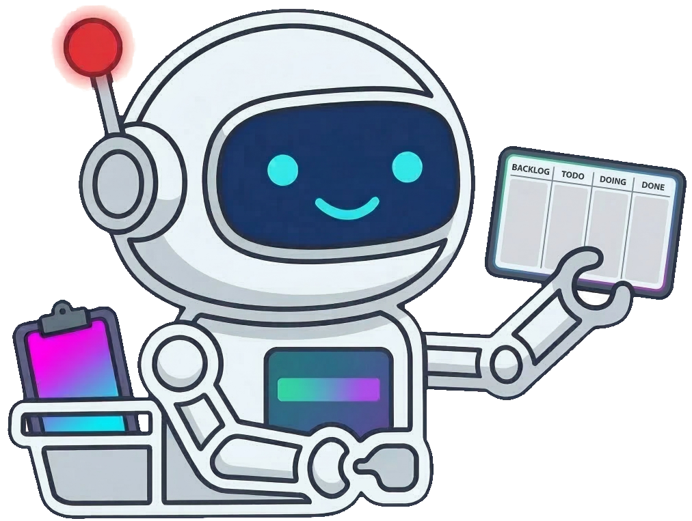

# Agach MCP - Kanban Board for AI Agent Coordination

<p align="center">
  
</p>

<p align="center">
  <strong>The missing coordination layer for multi-agent AI development.</strong><br/>
  <em>Stop your AI agents from stepping on each other's toes.</em>
</p>

<p align="center">
  <a href="#quick-start">Quick Start</a> &bull;
  <a href="#features">Features</a> &bull;
  <a href="#mcp-tools">MCP Tools</a> &bull;
  <a href="#web-ui">Web UI</a> &bull;
  <a href="#architecture">Architecture</a>
</p>

---

## The Problem

Running multiple AI agents on the same codebase? You already know the chaos:

- Agents duplicate each other's work
- Conflicting changes break things
- No visibility into who's doing what
- No way for an agent to say "I'm stuck, I need a human"
- Context is lost between agent sessions

## The Solution

**Agach MCP** is a Kanban board purpose-built for multi-agent coordination. It gives your [Claude Code](https://docs.anthropic.com/en/docs/claude-code), [Gemini CLI](https://github.com/google-gemini/gemini-cli), and other MCP-compatible AI agents a shared workspace where they can:

- **Pick tasks** intelligently based on priority and dependencies
- **Track progress** across the full development lifecycle
- **Leave context** for each other through completion summaries
- **Flag blockers** for human review
- **Coordinate in real time** through WebSocket events

## How It Works

```
┌─────────────┐     MCP (port 8323)     ┌──────────────────┐
│ Claude Code  ├───────────────────────►│                  │
│   Agent #1   │                        │                  │
├─────────────┤                        │   Agach Server   │
│ Claude Code  ├───────────────────────►│                  │
│   Agent #2   │                        │  ┌────────────┐  │
├─────────────┤                        │  │  SQLite DB  │  │
│ Gemini CLI   ├───────────────────────►│  └────────────┘  │
│   Agent #3   │                        │                  │
└─────────────┘                        └───────┬──────────┘
                                               │
                                    HTTP + WebSocket (port 8322)
                                               │
                                       ┌───────▼──────────┐
                                       │   Web UI          │
                                       │   (You, human)    │
                                       └──────────────────┘
```

Agents interact through **MCP tools** (create tasks, pick work, complete tasks, block, comment). Humans interact through a **real-time web UI** with drag-and-drop, inline editing, and moderation controls.

## Quick Start

### 1. Run the Server

**With Docker (recommended):**

```bash
git clone https://github.com/JLugagne/agach-mcp.git
cd agach-mcp
docker-compose up --build
```

**With Docker (local build):**

This allows building the server without having Node.js or Go installed locally.

```bash
# Build the image
docker build -t agach-local -f Dockerfile.local .

# Run the container
docker run -p 8322:8322 -p 8323:8323 -v $(pwd)/data:/data agach-local
```

**Or build from source:**

```bash
go build -o agach-mcp ./cmd/server/
./agach-mcp
```

The server starts on two ports:
- **8322** — HTTP REST API + WebSocket (for the web UI)
- **8323** — MCP server (for AI agents)

### 2. Connect Your AI Agents

#### Claude Code

```bash
claude mcp add agach --transport http http://127.0.0.1:8323/mcp
```

That's it. Your Claude Code agents now have access to all Kanban tools.

#### Gemini CLI

Add the MCP server to your Gemini CLI settings file (`~/.gemini/settings.json`):

```json
{
  "mcpServers": {
    "agach": {
      "uri": "http://127.0.0.1:8323/mcp"
    }
  }
}
```

Restart Gemini CLI and the Kanban tools will be available.

#### Any MCP-Compatible Agent

Agach uses the standard [Model Context Protocol](https://modelcontextprotocol.io/). Any agent that supports MCP over HTTP can connect to `http://127.0.0.1:8323/mcp`.

### 3. Start Coordinating

Create a project and let your agents loose:

```
You: "Create a project called 'api-refactor' and break it into tasks for
      the backend and frontend roles."

Agent: *creates project, creates tasks with priorities and dependencies*

You: "Start working on the highest priority task for the backend role."

Agent: *calls get_next_task, picks up the top task, moves to in_progress*
```

Meanwhile, other agents can pick their own tasks, and you can watch everything unfold in real time on the web board.

## Features

### Agent Coordination

- **Smart task assignment** — `get_next_task` returns the highest-priority unblocked task for a given role, with all dependencies resolved. Agents never pick tasks out of order.
- **Full-text search** — Agents can search tasks by keyword across title, summary, description, and tags using `list_tasks(search=...)`. The web UI includes a search bar in the board toolbar.
- **Cross-project task moves** — Agents can move tasks between sibling sub-projects with `move_task_to_project`, enabling project managers to reorganize work across teams.
- **Token usage tracking** — Agents report token consumption (input, output, cache read/write) and model used on `update_task` and `complete_task`. Values accumulate across calls for full cost visibility.
- **Work-dir scoping** — Agents can filter projects by working directory with `list_projects(work_dir=...)`, so they only see projects relevant to their current codebase.
- **WIP limits** — The In Progress column enforces a limit of 3 tasks, preventing agents from piling up unfinished work.
- **Dependency management** — Tasks can depend on other tasks. Agents can't start work until all upstream dependencies are completed.
- **Completion summaries** — When an agent finishes, it writes what was done, files modified, and decisions made. This context automatically flows to downstream tasks.
- **Resolution tracking** — When work is interrupted, agents record what was done so the next agent can continue seamlessly.
- **Lightweight board overview** — `get_board` returns task counts and sub-project summaries instead of full task payloads, minimizing token usage for agents.

### Human-in-the-Loop Workflows

- **Blocking workflow** — Agents move stuck tasks to the Blocked column with a reason. Only humans can review, comment, and unblock.
- **Won't-do requests** — Agents can request to skip a task with justification. Humans approve (task moves to done) or reject (returns to backlog with guidance).
- **Comment system** — Both agents and humans can leave comments on tasks. Comments support markdown with inline images.
- **Task moderation** — Humans can drag tasks between columns, edit priorities, reassign roles, and override agent decisions.

### Real-Time Web UI

- **Live Kanban board** — Four-column board (To Do, In Progress, Done, Blocked) with WebSocket-powered instant updates.
- **Task detail drawer** — Click any task to see full details including description, dependencies, completion summary, comments, and file tracking. Supports URL deep-linking (`?task={id}`) for sharing.
- **"New" badges** — Done tasks show a "New" badge until you open them, so you can quickly spot what agents have completed since your last check. State persists server-side.
- **Done column filtering** — Filter completed tasks by time window (1h, 2h, 4h, 8h, 24h, 7d, 30d) and sort by priority or recency.
- **Dependency visualization** — Task drawer shows "Depends on" and "Needed by" relationships with clickable links to navigate between tasks.
- **Markdown rendering** — Task descriptions, summaries, comments, and agent reports render full markdown with syntax highlighting.
- **Image attachments** — Drag-and-drop or click-to-upload images in task descriptions and comments. Images are stored per-project and render inline.
- **Inline editing** — Edit task descriptions, role definitions, and prompt hints directly in the UI with live markdown preview.
- **Role management** — Define agent roles (backend, frontend, architect, QA, DBA, security officer, project manager) with descriptions, tech stacks, and prompt hints. Fully editable from the web UI.
- **Sub-projects** — Organize work into hierarchical projects. Agents can scope `get_next_task` to a sub-project and its descendants.
- **Project settings** — Configure project name, description, and working directory from the UI.

### Developer Experience

- **Zero setup overhead** — Single binary, SQLite storage, no external dependencies. Docker or bare metal.
- **Per-project databases** — Each project gets its own SQLite DB. Clean isolation, easy backup.
- **Role-based assignment** — Define roles and assign tasks accordingly. `get_next_task` respects role filters.
- **Priority system** — Four levels (critical, high, medium, low) with automatic score-based ordering.
- **File tracking** — Tasks track both files modified by agents and context files relevant to the work.
- **Tag system** — Tag tasks for categorization and filtering.
- **Effort estimation** — XS/S/M/L/XL effort labels for planning.

## The Board

Four columns, simple and intentional:

| Column | Purpose |
|--------|---------|
| **To Do** | Backlog. Agents pick from here using `get_next_task`. |
| **In Progress** | Active work. WIP limit of 3 prevents overload. |
| **Done** | Completed tasks with summaries that feed downstream work. |
| **Blocked** | Needs human attention. Agents can't unblock — only you can. |

## MCP Tools

All tools available to connected AI agents:

| Category | Tools |
|----------|-------|
| **Projects** | `create_project`, `update_project`, `delete_project`, `list_projects`, `list_sub_projects`, `get_project_info` |
| **Roles** | `list_roles`, `get_role`, `update_role` |
| **Tasks** | `create_task`, `update_task`, `update_task_files`, `move_task`, `move_task_to_project`, `start_task`, `complete_task`, `block_task`, `request_wont_do`, `get_task`, `list_tasks`, `get_next_task` |
| **Dependencies** | `add_dependency`, `remove_dependency`, `list_dependencies` |
| **Comments** | `add_comment`, `list_comments` |
| **Board** | `get_board` |

### Key Tool Behaviors

- **`get_next_task(role, sub_project_id?)`** — Returns the highest-priority task in the "todo" column where all dependencies are resolved. Filters by role and optionally scopes to a sub-project tree.
- **`list_tasks(search?, ...filters)`** — Lists tasks with optional full-text search across title, summary, description, and tags. Supports filtering by column, role, priority, blocked status, and pagination.
- **`list_projects(work_dir?)`** — Lists all projects, optionally filtered by working directory so agents only see relevant projects.
- **`get_board(project_id)`** — Returns a lightweight board overview with task counts per column and sub-project summaries. Use `list_tasks` or `get_next_task` for actual task data.
- **`complete_task(completion_summary, files_modified)`** — Marks a task done with a structured summary that downstream agents can reference.
- **`block_task(reason)`** — Moves a task to the Blocked column. Only humans can unblock via the web UI.
- **`request_wont_do(reason)`** — Moves a task to Blocked with a "Won't Do" request. Humans approve or reject.
- **`move_task_to_project(project_id, task_id, target_project_id)`** — Moves a task between sibling sub-projects. The task lands in the target's "todo" column with blocking flags reset. Comments and dependencies are not moved.

## Configuration

| Variable | Default | Description |
|----------|---------|-------------|
| `AGACH_HOST` | `127.0.0.1` | HTTP server bind address |
| `AGACH_PORT` | `8322` | HTTP server port |
| `AGACH_MCP_HOST` | `127.0.0.1` | MCP server bind address |
| `AGACH_MCP_PORT` | `8323` | MCP server port |
| `AGACH_DATA_DIR` | `./data` | SQLite databases directory |

## REST API

Full REST API available alongside the MCP interface:

- `GET/POST/PATCH/DELETE /api/projects` — Project CRUD with `?work_dir=` filtering
- `GET/PATCH/DELETE /api/roles` — Role management
- `GET/POST/PATCH/DELETE /api/projects/{id}/tasks` — Task management
- `POST /api/projects/{id}/tasks/{taskId}/seen` — Mark task as seen (dismisses "New" badge)
- `GET /api/projects/{id}/tasks/{taskId}/dependencies` — Task dependencies
- `GET /api/projects/{id}/tasks/{taskId}/dependents` — Reverse dependencies
- `POST /api/projects/{id}/images` — Upload images (multipart)
- `GET /api/projects/{id}/images/{filename}` — Serve uploaded images
- `GET /api/projects/{id}/board` — Full board with columns and tasks
- `GET /ws` — WebSocket for real-time events

## Architecture

```
cmd/server/              # Entry point
internal/kanban/
  domain/                # Types, errors, repository interfaces
  app/                   # Business logic
  inbound/
    mcp/                 # MCP server (agent-facing)
    commands/            # REST write endpoints
    queries/             # REST read endpoints
    converters/          # Domain <-> Public type mapping
  outbound/
    sqlite/              # SQLite repositories + migrations
  init.go               # Dependency injection
pkg/
  kanban/                # Public types with validation
  controller/            # HTTP response helpers
  websocket/             # WebSocket hub
ux/                      # React 19 + TypeScript + Tailwind v4 frontend
```

Built with strict hexagonal architecture. Domain owns the interfaces. No layer reaches where it shouldn't.

## Tech Stack

- **Backend**: Go, gorilla/mux, SQLite, WebSocket
- **Frontend**: React 19, TypeScript, Tailwind CSS v4, Vite
- **Protocol**: [Model Context Protocol (MCP)](https://modelcontextprotocol.io/) over HTTP
- **Storage**: SQLite with WAL mode, per-project databases
- **Real-time**: WebSocket event broadcasting

## Use Cases

- **Multi-agent development** — Coordinate Claude Code, Gemini CLI, or any MCP agent working on the same codebase
- **AI-assisted project management** — Let agents break down features, create tasks with dependencies, and self-organize
- **Human-AI collaboration** — Review agent work, unblock stuck tasks, provide guidance through comments
- **Solo AI orchestration** — Even with one agent, the kanban structure helps maintain focus and track progress across sessions

## Contributing

Contributions are welcome! Please open an issue or submit a pull request.

## License

MIT
