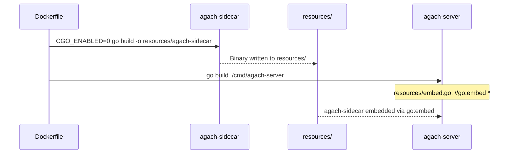
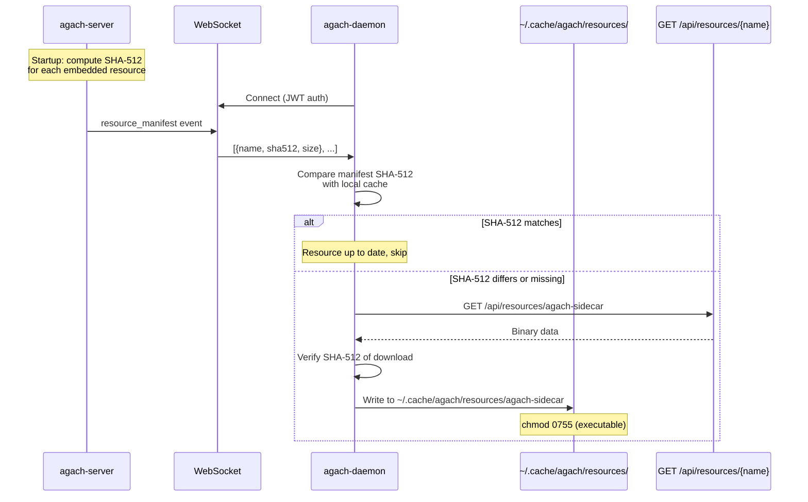
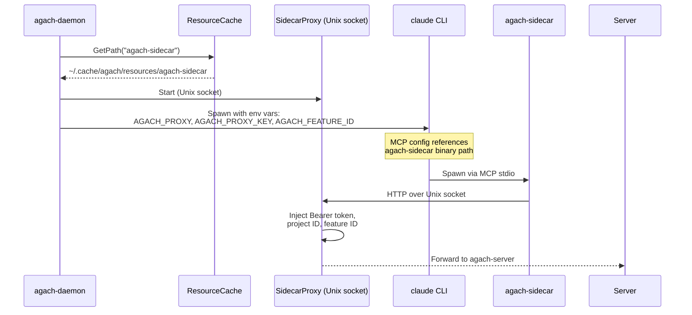

# Resource Distribution

The sidecar binary is embedded into the server at build time and distributed to daemons at runtime via a SHA-512 checksum-based sync protocol.

## Build-Time Flow

## Runtime Flow

## Chat Session Flow

## Security

- Resources are served over authenticated endpoints (JWT required)
- SHA-512 verification after download prevents tampering in transit
- The daemon only accepts resources whose hash matches the server-provided manifest
- The manifest is sent over the authenticated WebSocket connection
- Socket files are `chmod 0600` (owner-only access)
- Each sidecar session gets a unique cryptographic API key
